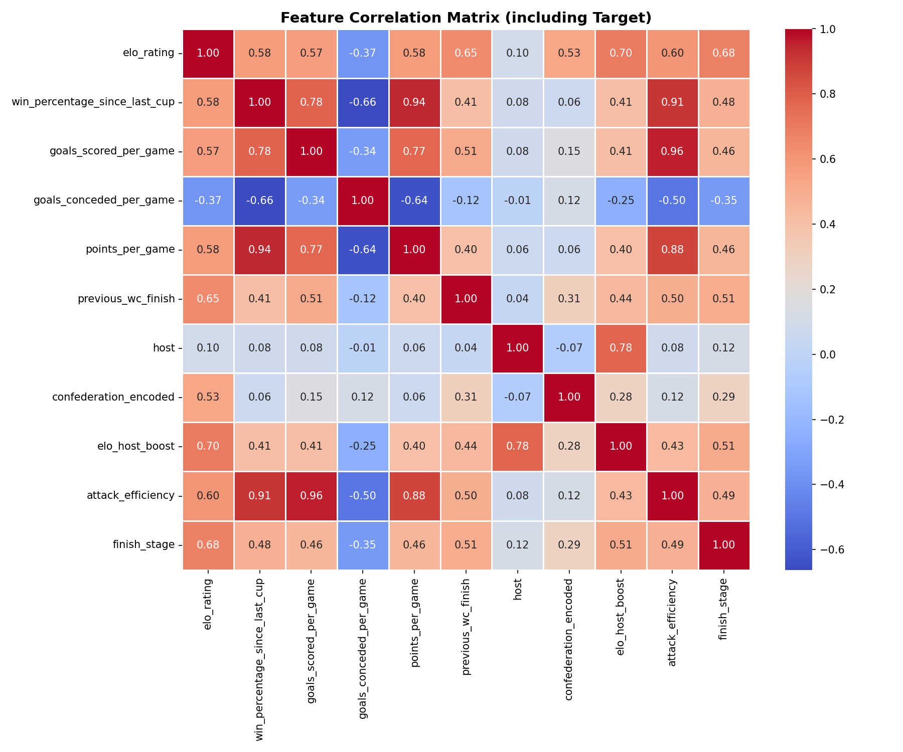
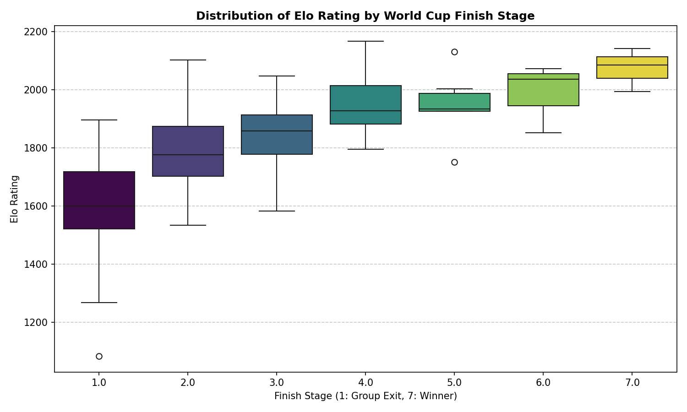
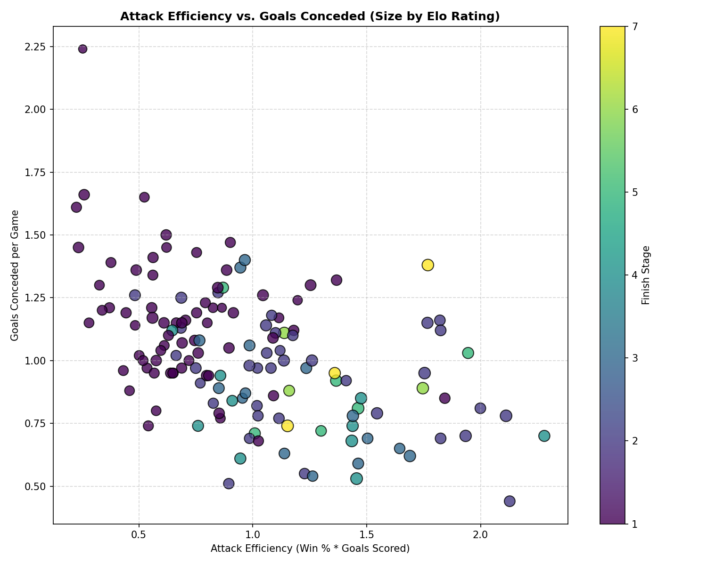
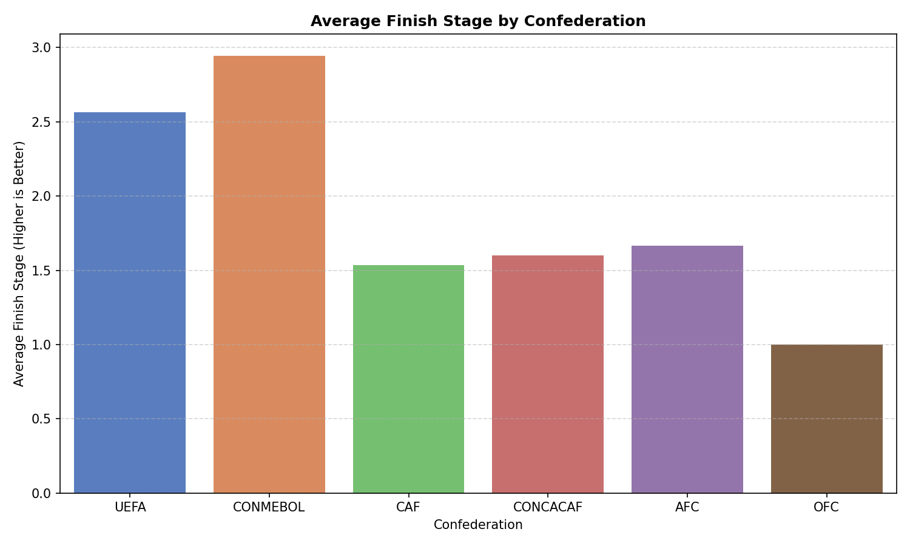

# 📊 Exploratory Data Analysis (EDA) Report
**FIFA World Cup 2026 Prediction Engine**

This report summarizes the insights, feature importances, multicollinearity checks, and statistical relationships observed in the historical World Cup dataset (2014–2022). These findings guide our model selection and feature engineering strategies.

---

## 📈 Key Visualizations

### 1. Correlation Matrix
The correlation matrix shows how each performance metric aligns with the tournament's final outcome (`finish_stage`) and detects redundant features:

### 2. Elo Rating by Tournament Finish Stage
Elo rating is the single strongest indicator of how deep a team progresses in the tournament. Teams that win the tournament (Stage 7) typically maintain Elo ratings above 2050:

### 3. Attack Efficiency vs. Goals Conceded
This scatter plot highlights the sweet spot of World Cup success. The color shows the finish stage (yellow/green being deeper runs), and size indicates Elo rating. Successful teams (yellow/green dots) occupy the bottom-right quadrant: high attack efficiency and low goals conceded per game:

### 4. Confederation Performance Comparison
UEFA and CONMEBOL teams historically achieve significantly deeper runs on average compared to other confederations:

---

## 🔢 Feature Importance and Analytics

### 1. Multicollinearity Check (VIF)
We calculated the **Variance Inflation Factor (VIF)** for all predictor features. A VIF value exceeding 5.0 indicates high multicollinearity, which can destabilize linear models (such as Ridge or Logistic Regression) but is generally handled well by tree-based ensembles (Random Forest, XGBoost).

| Feature | VIF Score | Status / Assessment |
| :--- | :---: | :--- |
| `elo_host_boost` | **123.99** | Extreme multicollinearity (Direct product of `elo` and `host`) |
| `host` | **64.60** | High multicollinearity |
| `attack_efficiency` | **63.82** | High multicollinearity (Product of `win_pct` and `goals_scored`) |
| `elo_rating` | **51.91** | High multicollinearity |
| `goals_scored_per_game` | **29.56** | High multicollinearity |
| `win_percentage_since_last_cup` | **23.42** | High multicollinearity |
| `points_per_game` | **9.77** | Moderate-High multicollinearity |
| `goals_conceded_per_game` | **2.43** | Safe / Low correlation with other features |
| `previous_wc_finish` | **1.94** | Safe |
| `confederation_encoded` | **1.77** | Safe |

*Insight*: The extremely high VIF for interaction terms means we must compare linear models (which assume feature independence) against tree-based regressor algorithms (which are immune to multicollinearity).

### 2. Information Sharing (Mutual Information)
Mutual Information (MI) regression measures how much predictive information a feature shares with the target `finish_stage`. An MI score of `0.0` indicates no statistical dependency.

| Feature | MI Score | Strength |
| :--- | :---: | :--- |
| `elo_host_boost` | **0.375** | Very High |
| `elo_rating` | **0.375** | Very High |
| `attack_efficiency` | **0.341** | High |
| `points_per_game` | **0.241** | Moderate-High |
| `win_percentage_since_last_cup` | **0.209** | Moderate |
| `previous_wc_finish` | **0.199** | Moderate |
| `goals_scored_per_game` | **0.192** | Moderate |
| `goals_conceded_per_game` | **0.146** | Moderate-Low |
| `confederation_encoded` | **0.083** | Low |
| `host` | **0.001** | Negligible |

*Insight*: Elo ratings and interaction terms share the most raw statistical dependency with World Cup outcomes. The raw host variable alone has near-zero MI because very few teams host the tournament, but `elo_host_boost` captures the combined strength multiplier.

### 3. Tree-Based Importance (Random Forest)
Random Forest feature importances reflect how frequently a feature is used to split data nodes to reduce variance.

| Feature | Importance | Strength |
| :--- | :---: | :--- |
| `elo_rating` | **43.2%** | Primary Predictor |
| `elo_host_boost` | **15.8%** | Secondary Predictor |
| `goals_conceded_per_game` | **13.8%** | Secondary Predictor (Defense) |
| `points_per_game` | **8.0%** | Moderate |
| `attack_efficiency` | **6.8%** | Moderate |
| `goals_scored_per_game` | **4.1%** | Low-Moderate |
| `win_percentage_since_last_cup` | **3.7%** | Low-Moderate |
| `previous_wc_finish` | **3.2%** | Low |
| `confederation_encoded` | **1.5%** | Negligible |
| `host` | **0.1%** | Negligible |

---

## 🏆 Modeling Recommendations

1. **Avoid Raw Linear Regressions**: Due to VIF scores exceeding 100 for key features, linear regression models will experience extreme coefficient inflation and instability. If using linear methods, L2 regularization (Ridge) must be applied, or collinear features must be dropped.
2. **Favor Tree Ensembles**: Random Forest and XGBoost are recommended since they partition features orthogonally and are unaffected by high VIF scores.
3. **Elo is the Foundation**: Over **59%** of the model's splitting criteria is driven by Elo rating and its host multiplier. Thus, accurate Elo ratings are paramount for high-quality predictions.
4. **Defense Wins Cups**: Goals conceded per game is more than **3x** as important to the random forest model than goals scored per game (13.8% vs. 4.1%), validating the football wisdom that strong defensive organization is critical for deep tournament runs.
